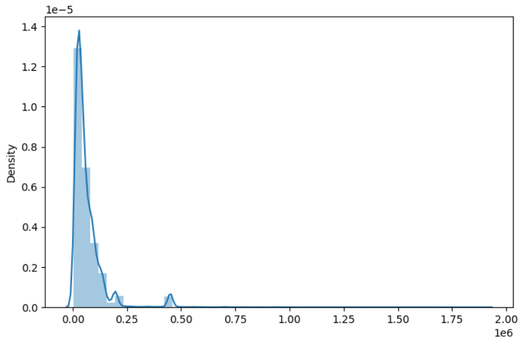
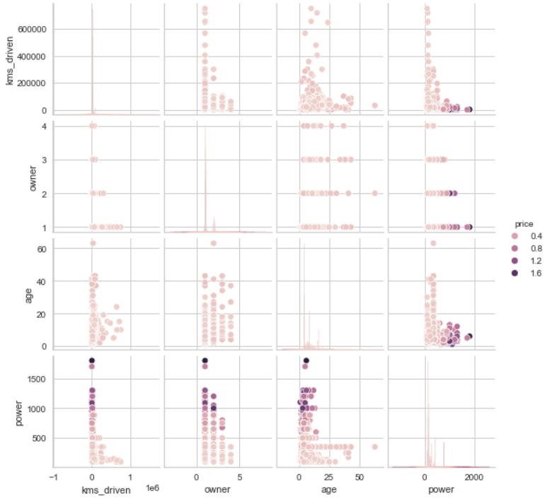
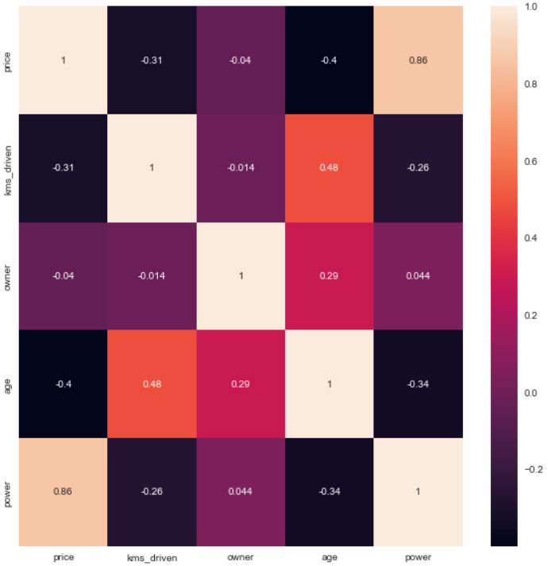
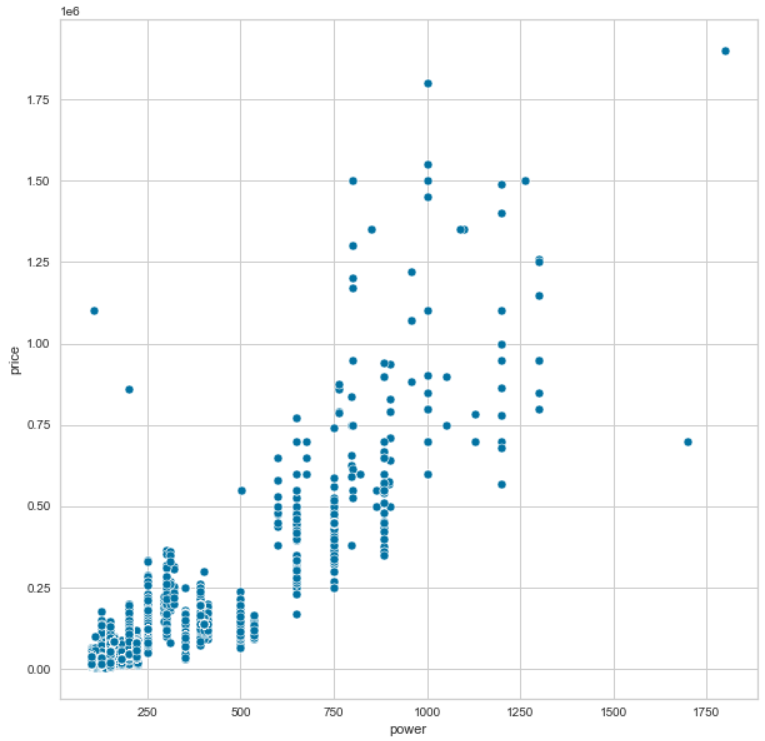

# **Predicción del precio de las motos usadas**

-----
### Este proyecto va a consistir en el análisis, exploración de datos y creación de un modelo de machine learning para la predicción del precio de motos usadas dependiendo de parámetros como el número de dueños anteriores, la potencia, la marca, los kilómetros recorridos, etc. Para ello he usado diferentes herramientas y librerías enfocadas al machine learning.

-----

### Organización de carpetas: 

* scr/
    * data/: Contiene los archivos usados en el proyecto.
    
    * Imagenes/: Contiene imágenes usadas en este archivo Markdown.

    * Model/: Contiene los modelos realizados en el proyecto.

    * notebooks/: son archivos jupyter notebook usados en todo el proceso.

------

### Fuente: [Kaggle](https://www.kaggle.com/datasets/saisaathvik/used-bikes-prices-in-india)

------

### En este proyecto de pueden apreciar conocimientos en:

* Python
* PyCaret
* Visualization
* Ensemble models
* Feature Engineering
* Supervised Learning
* Regression Models

------

## **Importación de los datos**

#### Leemos el archivo csv con los datos y vemos que tenemos las variables 'bike_name', 'price', 'city', 'kms_driven', 'owner', 'age', 'power' y 'brand'.

bike_name	|price	|city	|kms_driven|	owner	|age	|power	|brand
----|----|----|---|----|----|---|----
TVS Star City Plus Dual Tone 110cc|	35000.0|	Ahmedabad|	17654.0|	First Owner	|3.0|	110.0|	TVS
Royal Enfield Classic 350cc	|119900.0|	Delhi	|11000.0|	First Owner	|4.0	|350.0|	Royal Enfield
Triumph Daytona 675R	|600000.0	|Delhi	|110.0	|First Owner	|8.0	|675.0|	Triumph
TVS Apache RTR 180cc	|65000.0	|Bangalore	|16329.0	|First Owner	|4.0|	180.0	|TVS
Yamaha FZ S V 2.0 150cc-Ltd. Edition	|80000.0|	Bangalore	|10000.0	|First Owner|	3.0	|150.0	|Yamaha

columnas:
* bike_name: Nombre de la moto
* price: Precio
* city: Ciudad donde se realiza la venta
* kms_driven: Kilómetros recorridos con la moto
* owner: Número de dueños anteriores a la venta
* age: Edad de la moto
* power: Potencia del motor
* brand: Marca de la moto
## **Análisis exploratorio de los datos y transformación de datos**
#### Veamos la información general de nuestros datos.

RangeIndex: 32648 entries, 0 to 32647

Data columns (total 8 columns):

 #  | Column   |   Non-Null Count | Dtype  
--- | ------    |  -------------- | -----  
 0  | bike_name |  32648 non-null | object 
 1 |  price     |  32648 non-null | float64
 2  | city      |  32648 non-null  |object 
 3  | kms_driven| 32648 non-null  |float64
 4  | owner     |  32648 non-null  |object 
 5  | age       |  32648 non-null  |float64
 6  | power     |  32648 non-null  |float64
 7  | brand     |  32648 non-null  |object 

 #### Vemos que tenemos algunas columnas de tipo `object` y no tenemos valores nulos.

#### Veamos la información que nos da `data.describe()` para las columnas numéricas.

medida|price|	kms_driven|age	|power
---| ----|----|----|-----|
count	|3.264800e+04	|32648.000000	|32648.000000	|32648.000000
mean	|6.829542e+04	|26344.625184	|8.048211	|213.511302
std|	9.071860e+04	|22208.527695	|4.031700	|134.428868
min|	4.400000e+03	|1.000000	    |1.000000	|100.000000
25%|	2.500000e+04	|12000.000000	|5.000000	|150.000000
50%|    4.300000e+04	|20373.000000	|7.000000	|150.000000
75%|	8.000000e+04	|35000.000000	|10.000000	|220.000000
max|	1.900000e+06	|750000.000000	|63.000000	|1800.00000
#### Vemos mucha información pero la más relevante sería que la desviación estandar de nuestra variable `Price` es de 90.718, que es bastante aunque es comprensible teniendo en cuenta que el mínimo es 4.400 y el máximo 1.900.000. También vemos que la mediana se encuentra  en 43.000, bastante más cerca del mínimo al igual que la media de 68.295. Con respecto a las demás variables podemos ver que el mínimo de kilómetros recorridos y el máximo son 750.000 que ya son bastantes. Tenemos el mínimo de edad de la moto como un año y el maximo de 63 años. El mínimo de l apotencia es de 100cc y el mácimo de 1800cc. Vemos que tenemos motos de todo tipo y de muy diversas capacidades.

#### Veamos graficamente la distribución de nuetra variable objetivo 'Price'.

#### Podemos ver que la mayoría de los precios se concentran entre 0 y 250.000 sobretodo con un pico al rededor de los 100.000 lo que nos dice a cuánto precio venden la mayoría de las motos. También vemos que hay otras motos que se alejan bastante de lo común en cuanto al precio hasta llegar casi hasta los 2.000.000.

--------
#### Nuestras variables tipo `object` son ''bike_name', 'city', 'owner'y 'brand'. Las tendremos que convertir a tipo numérico para poder usarlas en el modelo.

#### EN nuestra variable 'owner' tenemos estas clases de datos:'First Owner', 'Second Owner', 'Third Owner', 'Fourth Owner Or More' y como vemos, nos indican el número de propierarios anteriores de la moto pero nos lo muestran como texto así que vamos a cambiar estas clases a tipo numérico.

### Ahora nuestra columna "owner" quedaría así:
índice| valor
----|----
0|        1
1|       1
2 |       1
3 |       1
4 |       1
  ...  |...
32643 |   1
32644 |   1
32645|    1
32646 |   1
32647 |   1
-----
#### Nuestra variable 'owner' tiene un mínimo de 1 y un máximo de 4 lo que nos indica que hay motos tanto de uno como de 4 anteriores dueños. También vemos que la mediana indica un 1 así que la mayoría de las motos solo han tenido un dueño.
medida|owner
----|-----
count|    32648.000000
mean|         1.086253
std |         0.296037
min |         1.000000
25% |         1.000000
50%  |        1.000000
75%  |        1.000000
max  |        4.000000
#### Vamos a visualizar las relaciones entre todas las variables numéricas entre sí.

#### Observamos que nuestras variables no tienen demasiada relación entre ellas excepto con la variable "price" con la que todas comparten algo de relación.

#### Otra forma de visualizar las relaciones es con una matriz de correlación donde el máximo es 1 e infica que tienen una correlación lienal perfecta y el mínimo es 0 que indica que no tienen absolutamente nada de correlación.

#### Aquí podemos observar que la variable con mayor correlación con la variable objetivo es 'power', la potencia del motor y también vemos que las variables predictoras no tienen demasiada correlación entre ellas lo que nos viene muy bien para que el modelo no caiga en overfitting.

#### Para las demás variables tipo `object` vamos a aplicar un `pd.get_dummies()` a nuestro dataset. Nos quedarían 942 variables.

## Creación del modelo

1. creamos la variable x e y separando la variable 'price' del resto.
2. Dividimos entre train y test.
3. Creamos el setup de Pycaret con nuestro dataset
4. Comparamos entre más de 25 modelos con parámetros por defecto para ver a primera vista cuál modelo viene mejor para este caso.
5. 